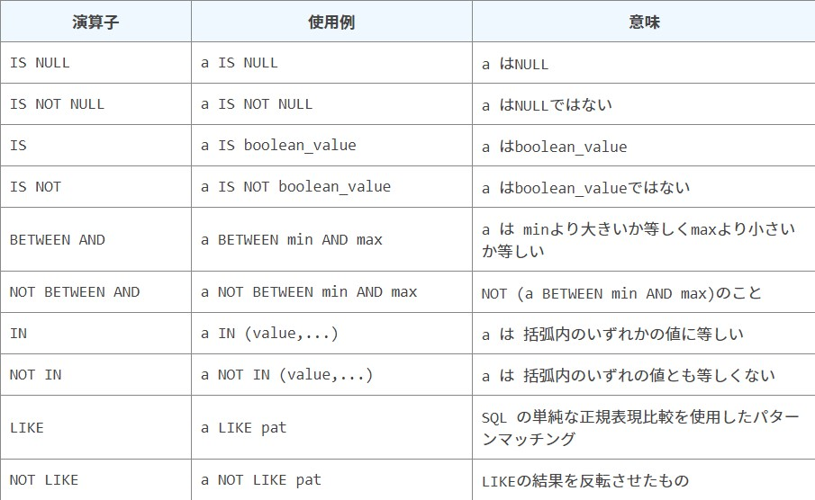

# SELECT
## 要素の説明
|記述|説明|
| ---- | ---- |
|列名|fromで参照対象にしているテーブルのカラム|
|*|参照先のカラム全て|
|定数|固定の値|
|関数()|指定の処理結果を返す [関数](./関数.md)|
|式|計算や論理演算を行う、定数も式の一つと言える|

<br>

## 句に記述できるもの
|句|対象|
|----|----|
|SELECT|カラム(列名), 定数, 関数, 式, サブクエリ|
|WHERE|列名, 定数 からなる論理式|
|GROUP BY|SELECTで指定している列名|
|HAVING|SELECTとGROUP BYで指定している列名, 定数, 集約関数 からなる論理式|
|ORDER BY|SELECTとGROUP BYで指定している列名, 定数, 集約関数, SELECTで指定している別名|

<br>

## 対象を限定する句
|記述|説明|
| ---- | ---- |
|WHERE|条件1 グループ分けの前に処理される|
|GROUP BY|グループ化 指定した列の値が同じレコードを集約する|
|HAVING|条件2 グループ化の後に処理される、式に[集約関数](./関数.md)を使用できる|
|ORDER BY|並び替え|
- 条件: 指定した式がTRUE以外のレコードを無視する事
- [集約関数とGROUP BY](./関数.md)
- GROUP BYで別名を使うと、DBによってはエラーになる

<br>

## その他よく使われえる句
### AS
- 列やテーブルに別名を付けて、別名で表示させる
- 列を入力する時の、その右に`AS 別名`を付ける
  - 別名はクォーテーションで囲んでも囲わなくてもいい(MySQLの場合)

### DISTINCT
- 列選択の前に記述と、レコードの重複を省く
- 複数列を選択してる場合は、その複数選択したカラム全てに対して1つ記述する
- [集約関数](./関数.md)の引数の前に置くこともできる

<br>

## 演算
### 算術演算

<br>

### 比較演算(文字列の比較)
- 基本的な比較演算が行える(=, !=, >等)
  - !=を<>と書いたり、色々な書き方がある
- 文字列の比較演算は1文字目 → 2文字目と行われていく
  - 'abc', 'acb', 'bac'だと並び順は、'abc' > 'acb' > 'bac'
- NULLに比較演算子は使えない(比較結果は不明になる)
- 述語(特別な比較演算子のようなもの) [詳細](./4_述語.md)



<br>

### 論理演算子
- 基本的なプログラムと同じように、AND OR NOTがある
- SQLには普通の真偽の他に不明がある
  - 最終結果が不の場合は表示されない
  - 不は中間の強さで働く
    - ANDの場合: 真 < 不 < 偽
    - ORの場合: 偽 < 不 < 真

<br>

# 句の詳細
## INSERT
### 句
|句|説明|
|----|----|
|VALUE, VALUES|新規の値を代入する|
|SELECT|SELECT文で取得した値を代入する|

<br>

### 値を挿入時の挙動
- デフォルト値を入れたい場合は DEFAULTを記述する
- NULLを入れたい場合は DEFAULTを記述する
- 指定列にない値は、デフォルト値、またはNULLが挿入される

<br>

## UPDATE
- `SET カラム = 式` と記述して、式の結果をカラムに代入する
  - カラム名, 定数, 関数が使用できる
- SELECTと同じWHERE句を使用して、対象レコードを絞って更新を行える

## DELETE
- `TRUNCATE` table_name: DELETEの代わりに全レコード削除を高速で行える
- SELECTと同じWHERE句を使用して、対象レコードを絞って削除を行える

<br>

## DML共通の句
|句|順番|説明|
| ---- | ---- | ---- |
|DML|1||
|JOIN|2|結合|
|WHERE 式|3|対象レコードを、式が真になるものに絞る|
|SELECT限定の句|4||
|LIMIT n|5|対象レコードの数をn個に制限する|
|集合演算子|6|集合演算|

<br>

# トランザクション
## トランザクションとは
- 処理の固まり
- 途中で障害が起きてもACIDを守れるようにするために必須

## 文法
- START TRANSACTIONを行うと、トランザクションが開始される
- COMMITを行うと、トランザクションが終了し、DMLの結果が確定する
- ROLLBACKを行うと、トランザクションを行う前に戻る
```sql
START TRANSACTION;
  DML

ROLLBACK;
または
COMMIT;
```
